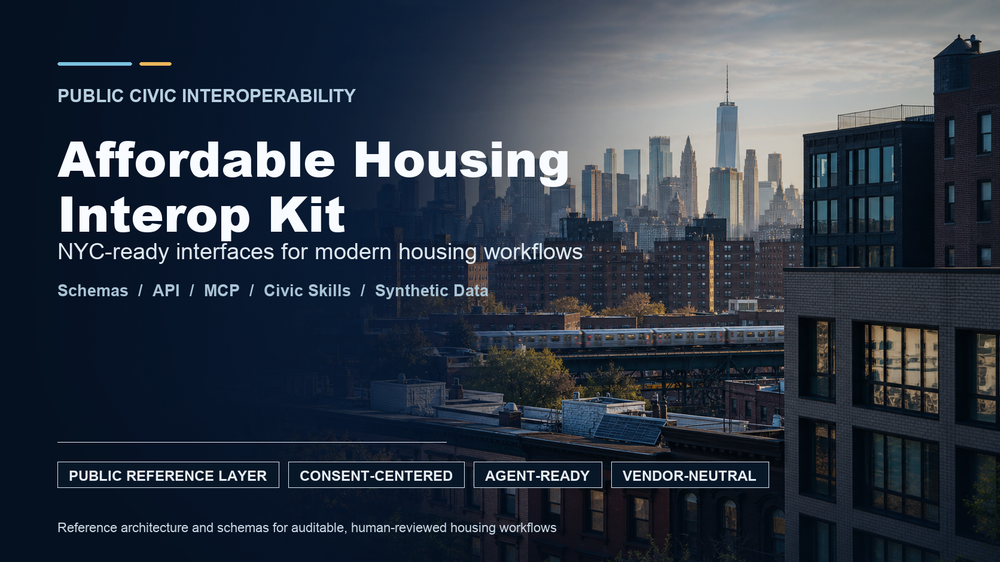

<p align="center">
  
</p>

# Affordable Housing Interop Kit


An open reference architecture for modern, auditable, agent-ready affordable housing application workflows.

This repository defines a public interoperability layer: a neutral set of schemas, APIs, MCP tools, civic skill definitions, CLI commands, synthetic data, and implementation patterns that housing operators, software vendors, civic technology teams, and public agencies can build against.

It uses synthetic data for safety and repeatability. The focus is the shared interface surface for privacy-preserving, inspectable, interoperable affordable housing infrastructure.

## Why This Exists

Affordable housing workflows sit between tenants, marketing agents, owners, compliance teams, and public agencies. The current ecosystem often depends on brittle handoffs, manual status checks, duplicated data entry, opaque eligibility steps, and vendor-specific workflows.

The next generation should be different:

- tenant-consented data flows
- clear audit trails
- standardized application packets
- machine-readable eligibility and document requirements
- secure status updates
- reusable civic skills
- public-facing integration patterns
- agent-ready workflows with human oversight
- enough openness that multiple vendors can participate fairly

This kit is a reference point for that future.

## Scope

This repo defines a reference interoperability layer for affordable housing workflows:

- **Schemas** for applicants, households, applications, document requests, status events, notices, and audit records.
- **OpenAPI spec** for conventional software integrations.
- **MCP tools** for agentic workflows.
- **Civic skill catalog** for repeatable, reviewable housing capabilities.
- **CLI command surface** for developer and operator workflows.
- **Synthetic data harness** so teams can test without private or regulated data.
- **Principles and governance docs** to keep the effort public-spirited, transparent, and safe.

## Reference Boundaries

The reference layer is designed for standards discussion, synthetic workflow testing, and implementation planning. It covers:

- interface design
- synthetic examples
- reference API/MCP/CLI surfaces
- privacy and consent patterns
- audit event modeling
- human-reviewed agent actions

## Guiding Posture

The guiding posture is simple:

> Make the gate legible, documented, auditable, and usable by everyone.

An affordable housing platform should have a clear, trustworthy way to participate in a modern workflow. If a city, agency, owner, marketing agent, or technology provider wants to build a better application experience, the interface should be clear enough to reason about and safe enough to trust.

## Core Concepts

### Application Packet

A structured, tenant-consented bundle of household, income, preference, document, and eligibility information.

### Consent Grant

A bounded permission from a tenant or applicant allowing a specific party or system to use specific data for a specific purpose.

### Status Event

A machine-readable update in the application lifecycle: submitted, missing documents, under review, eligible, ineligible, selected, waitlisted, withdrawn, or closed.

### Document Request

A structured request for missing or expired documents, including reason, due date, acceptable formats, and responsible party.

### Audit Trail

An append-only log of actions taken by humans, systems, or agents, with timestamps, actor identity, purpose, and source.

### Agent Tool

A carefully scoped action an AI agent can take through MCP or another tool interface, with explicit guardrails and review boundaries.

### Civic Skill

A repeatable housing workflow capability, such as packet validation, missing-document drafting, or applicant status explanation, described in plain language and mapped to auditable tools, approval boundaries, and expected outputs.

## Repository Map

```text
.
├── README.md
├── package.json                 # scripts: generate · validate · demo · mcp · test
├── openapi.yaml                 # REST interface spec (reference)
├── lib/
│   ├── validate.mjs             # ajv schema validator — validate(name, data) -> { valid, errors }
│   ├── audit.mjs                # makeAuditEvent(...) -> schema-valid audit record
│   └── demo.mjs                 # runDemo() — end-to-end flow + negative path
├── synthetic-data/
│   ├── generate.mjs             # seedable synthetic application-packet generator
│   ├── fixtures/                # committed golden packets (seed 42, reproducible)
│   └── README.md
├── cli/
│   ├── ahik.mjs                 # CLI: demo · mcp · help
│   └── ahik.md                  # CLI reference
├── mcp/
│   ├── server.mjs               # reference MCP stdio server (6 audited tools)
│   └── tools.md                 # tool reference
├── scripts/
│   ├── validate-json.mjs        # JSON parse check
│   └── validate-schema.mjs      # schema validation of examples
├── test/                        # node:test suites (11 tests)
├── schemas/
│   ├── application-packet.schema.json
│   ├── status-event.schema.json
│   ├── document-request.schema.json
│   └── audit-event.schema.json
├── examples/                    # synthetic example payloads
├── docs/                        # architecture · principles · governance · security · skill-catalog · ...
├── assets/cover.png
├── AUTHORS.md
├── CONTRIBUTING.md
├── CODE_OF_CONDUCT.md
├── LICENSE
└── .github/workflows/validate.yml   # CI: install -> validate -> generate -> demo -> test
```

## Example Agent Actions

An AI agent should never have unlimited access to sensitive housing workflows. It should operate through narrow, auditable tools. The reference MCP server (`mcp/server.mjs`) implements **six** such tools today, and every call returns a real audit event:

- `validate_application_packet` — validate a packet against the schema (runs the real validator)
- `create_document_request_draft` — draft a request for a missing document *(human review required)*
- `summarize_application_status` — produce an applicant-friendly status summary
- `record_consent_grant` — record a synthetic consent grant
- `append_audit_event` — append a synthetic audit event
- `generate_notice_draft` — draft an applicant-facing notice *(human review required)*

Each tool specifies:

- required inputs
- allowed outputs
- human approval boundary
- privacy classification
- audit behavior
- failure modes

These are **audited reference stubs** over synthetic data — they exercise the real interface and audit model without a backend. Additional tools (e.g. `create_application_packet`, `request_missing_documents`) are planned. See [mcp/tools.md](mcp/tools.md).

## Civic Skill Catalog

> **Status:** Implemented commands are listed under **Quickstart**. Everything else in this kit is a documented **(planned)** reference surface.

Skills make the platform story easier to understand. A skill is the product-level capability; an MCP tool is one way that capability can be executed safely.

Examples:

- application packet completeness check
- missing-document request draft
- applicant status explanation
- eligibility evidence organizer
- consent grant recorder
- audit trail explainer
- synthetic lease-up simulator

Each skill should define the user it serves, the inputs it needs, the tools it may call, the review boundary, the audit events it creates, and the failure modes it must disclose.

See [docs/skill-catalog.md](docs/skill-catalog.md).

## Quickstart

Requires Node 22+.

```bash
npm install
npm run generate     # write fresh synthetic application packets to synthetic-data/out/
npm run validate     # JSON + schema validation of schemas, examples, and fixtures
npm run demo         # one synthetic end-to-end flow: generate -> validate -> status + audit (+ a rejected-packet example)
npm run mcp          # start the reference MCP server (stdio)
npm test             # run the test suite (11 tests)
```

> Run everything from a clone of this repo (the commands resolve to repo-local code). No global install or npm package required.

**What runs today:**

- `npm run generate` emits schema-valid synthetic application packets. The generator is **seedable** — `node synthetic-data/generate.mjs 3 --seed 42 --out fixtures` reproduces the committed golden fixtures byte-for-byte (so CI can detect drift); unseeded runs are fresh each time.
- `npm run demo` shows the full pattern end to end: a packet is organized, validated, turned into a plain-language **status event** for the applicant, and an **audit event** is written for every step. It then runs a **negative path** — a deliberately invalid packet is caught at the schema level and the rejection is itself logged.
- `npm run mcp` starts the reference MCP server over stdio, exposing the six audited tools above.
- CI (`.github/workflows/validate.yml`) runs `validate -> generate -> demo -> test` on a clean checkout, so "it runs from a fresh clone" is enforced, not asserted.

| Surface | Status |
| --- | --- |
| JSON schemas, OpenAPI spec, examples | implemented |
| Synthetic generator (seedable) + golden fixtures | implemented |
| Validator (`npm run validate`) + test suite (11 tests) | implemented |
| End-to-end demo (`ahik demo`) with negative path + audit | implemented |
| MCP reference server (6 audited stub tools) | implemented |
| Full skill catalog (e.g. Synthetic Lease-Up Simulator) | planned |

See [docs/diagrams.md](docs/diagrams.md) for the architecture diagram.

## Design Principles

- **Public good first**: the standard should help the ecosystem, not only one vendor.
- **No private data in the standard**: examples must be synthetic.
- **Tenant consent is central**: data movement must be intentional and bounded.
- **Audit everything**: every meaningful action should be reconstructable.
- **Human-in-the-loop by default**: agents can assist, but sensitive decisions need review.
- **Vendor-neutral by posture**: any compliant system can implement the interface.
- **Modern but legible**: OpenAPI, MCP, CLI, and clear docs should serve both technical and policy audiences.

See [docs/principles.md](docs/principles.md).

## Project Status

Status: public reference implementation.

This repository is suitable for:

- technical alignment
- public-sector review
- implementation planning
- synthetic workflow testing
- production-grade governance, privacy, and review-boundary design

## License

Code is licensed under the MIT License. Documentation and examples are available under CC BY 4.0.

## Acknowledgments

The original concept and initial scaffolding for this kit came from **Clark Valberg**.

## Note

This is an independent reference project built by Zach Rabin, who works on
affordable-housing-application technology. It is **not affiliated with, endorsed by, or
built under contract with** the City of New York, HPD, or any housing agency. All data and
examples are synthetic.
