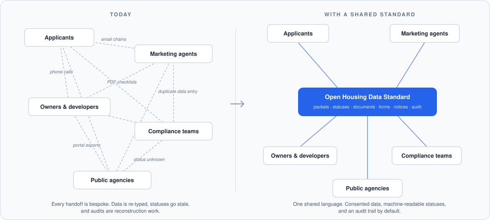
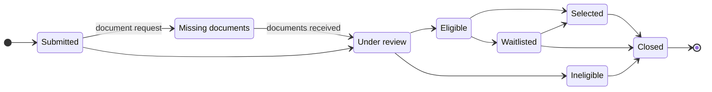

<p align="center">
  
</p>

# Open Housing Data Standard

**An open data standard for New York's affordable housing applications.**


Every affordable housing application passes through many hands: the applicant, a marketing agent, an owner, a compliance team, and one or more public agencies. Today those handoffs run on PDF checklists, phone calls, email chains, and duplicated data entry. Each organization keeps its own copy of the truth, and nobody, including the applicant, can see the whole picture.

This project proposes a shared, open way to represent that work. Think of it as a common language for housing applications, the way the Common App became a common language for college admissions. It is free to use, open to inspection, and owned by no single vendor. Anyone can implement it, including organizations that compete with each other.

*Open Housing Data Standard is a working name. One of the first things we want to decide with co-stewards is what this effort should be called.*

## The idea in one picture

Every application moves through the same lifecycle, no matter who runs the building or which software they use. The Standard gives each step a shared, machine-readable form:



An application can also be withdrawn by the applicant at any point. Every arrow in that picture is a **status event** any compliant system can read. Six building blocks flow through the lifecycle, and the Standard defines a schema for each:

| Building block | What it is |
| --- | --- |
| **Application packet** | A structured, tenant-consented bundle of household, income, document, and eligibility information |
| **Status event** | A machine-readable update in the application lifecycle |
| **Document request** | A structured request for a missing or expired document, with reason, due date, and acceptable formats |
| **Form** | A required instrument completed and signed by the parties, such as a Tenant Income Certification, with completion state, signers, and effective period |
| **Notice** | A structured applicant-facing communication: appointments, deadlines, eligibility outcomes, lease offers |
| **Audit event** | An append-only record of every meaningful action, by human or software, with actor, purpose, and timestamp |

The Standard models forms at the instance level today: which form, its status, who signed it, what period it covers. Machine-readable form *definitions*, so a certification completed once can be understood and reused by any compliant system, are the headline of where the Standard goes next.

Plain-language definitions for every term live in [docs/concepts.md](docs/concepts.md).

## Find your door

### If you run lease-up or marketing for affordable housing

A shared standard means an application prepared once can be understood everywhere, statuses answer themselves instead of generating phone calls, and switching or adding software vendors stops meaning starting over. [docs/nyc-context.md](docs/nyc-context.md) maps the Standard onto the New York lease-up workflow you already know.

You do not need to read code, or use GitHub at all, to be part of this. See [How to participate](#how-to-participate).

### If you build housing software

The repository contains JSON schemas, an OpenAPI surface, MCP tools for agent workflows, a runnable reference implementation with a synthetic data harness, and a test suite. Everything runs from a fresh clone; see [For developers](#for-developers). The Standard is vendor-neutral by design: any compliant system can implement it, and no implementer owes anything to any other.

### If you work in government or policy

The Standard is built for public-sector scrutiny: every example is synthetic, tenant consent is a first-class object rather than an afterthought, every action lands in an append-only audit trail, and agent-driven actions carry explicit human-review boundaries. Start with [docs/security-and-privacy.md](docs/security-and-privacy.md), [docs/principles.md](docs/principles.md), and [docs/governance.md](docs/governance.md).

## How to participate

This is an open invitation, and it is deliberately easy to accept.

- **Support the Standard.** Read [CHARTER.md](CHARTER.md), which states the principles and exactly what supporting does and does not commit you to (no fees, no exclusivity, no obligation to adopt anything). To be listed in [SUPPORTERS.md](SUPPORTERS.md), email **russ@harmonyworks.com** and **zach@harmonyworks.com** with your organization's name, or open a pull request.
- **Give feedback.** Email works. So do [GitHub issues](../../issues) and [discussions](../../discussions) if that is your habitat. We want to hear what is wrong or missing at least as much as what resonates.
- **Implement or co-steward.** If you want to build against the Standard or help govern it, [docs/governance.md](docs/governance.md) describes the path from supporter to co-steward.

A convening of supporters is being planned. Supporters will be the first to hear about it.

## What's in this repository

- **Schemas** for application packets (applicant, household, consent grants, documents), status events, document requests, forms, notices, and audit records
- **OpenAPI spec** for conventional software integrations
- **MCP tools** for agent workflows with human-review boundaries
- **Civic skill catalog** for repeatable, reviewable housing capabilities
- **CLI and reference implementation** so the Standard is runnable, not just readable
- **Synthetic data harness** so teams can test without private or regulated data
- **Principles and governance docs** to keep the effort public-spirited, transparent, and safe

| Surface | Status |
| --- | --- |
| JSON schemas (6), OpenAPI spec, examples | implemented |
| Synthetic generator (seedable) + golden fixtures | implemented |
| Validator + test suite (30 tests) | implemented |
| End-to-end demo (`ahik demo`) with negative path + audit | implemented |
| Skills: completeness check + applicant status explanation | implemented |
| MCP reference server (7 tools: 3 real skills + 4 audited stubs) | implemented |
| Remaining skill catalog (e.g. synthetic lease-up simulator) | planned |

More diagrams, including the human-in-the-loop agent flow, live in [docs/diagrams.md](docs/diagrams.md).

## For developers

Requires Node 22+. Run everything from a clone of this repo; no global install needed.

```bash
npm install
npm run generate                  # write fresh synthetic application packets to synthetic-data/out/
npm run validate                  # JSON + schema validation of schemas, examples, and fixtures
npm run demo                      # end-to-end flow: generate -> validate -> status + audit (+ a rejected-packet example)
node cli/ahik.mjs completeness    # skill: flag a packet's outstanding documents (synthetic) for human review
node cli/ahik.mjs status          # skill: produce a plain-language applicant status draft (human-review-gated)
npm run mcp                       # start the reference MCP server (stdio)
npm test                          # run the test suite (30 tests)
```

The reference MCP server exposes seven narrowly scoped, audited tools (validate a packet, check completeness, summarize status, draft a document request, record a consent grant, append an audit event, draft a notice). Every call returns an audit event, and applicant-facing drafts require human review. See [mcp/tools.md](mcp/tools.md) and [docs/skill-catalog.md](docs/skill-catalog.md).

CI runs `validate -> generate -> demo -> test` on a clean checkout, so "it runs from a fresh clone" is enforced, not asserted.

<details>
<summary>Repository map</summary>

```text
.
├── README.md
├── CHARTER.md                   # the principles + what supporting means
├── SUPPORTERS.md                # organizations supporting the Standard
├── package.json                 # scripts: generate · validate · demo · mcp · test
├── openapi.yaml                 # REST interface spec (reference)
├── lib/
│   ├── validate.mjs             # ajv schema validator
│   ├── audit.mjs                # makeAuditEvent(...) helper
│   ├── demo.mjs                 # runDemo(): end-to-end flow + negative path
│   └── skills/                  # real skills: completeness.mjs · status-explanation.mjs
├── synthetic-data/              # seedable generator + committed golden fixtures
├── cli/                         # ahik CLI + reference
├── mcp/                         # reference MCP stdio server + tool reference
├── scripts/                     # JSON + schema validation scripts
├── test/                        # node:test suites (30 tests)
├── schemas/
│   ├── application-packet.schema.json
│   ├── status-event.schema.json
│   ├── document-request.schema.json
│   ├── form.schema.json
│   ├── notice.schema.json
│   └── audit-event.schema.json
├── examples/                    # synthetic example payloads
├── docs/                        # concepts · nyc-context · architecture · principles · governance · security · ...
└── .github/workflows/validate.yml   # CI: install -> validate -> generate -> demo -> test
```

</details>

## Design principles

- **Public good first**: the Standard should help the ecosystem, not only one vendor.
- **No private data in the Standard**: examples must be synthetic.
- **Tenant consent is central**: data movement must be intentional and bounded.
- **Audit everything**: every meaningful action should be reconstructable.
- **Human-in-the-loop by default**: agents can assist, but sensitive decisions need review.
- **Vendor-neutral by posture**: any compliant system can implement the interface.
- **Modern but legible**: OpenAPI, MCP, CLI, and clear docs should serve both technical and policy audiences.

See [docs/principles.md](docs/principles.md).

## License

Code is licensed under the MIT License. Documentation and examples are available under CC BY 4.0.

## About this project

The Open Housing Data Standard was initiated by [Harmony](https://harmonyworks.com), which builds affordable housing application technology, and is offered as a public good in search of co-stewards. The original concept and initial scaffolding came from Clark Valberg.

This project is **not affiliated with, endorsed by, or built under contract with** the City of New York, HPD, HDC, or any housing agency. All data and examples are synthetic.
