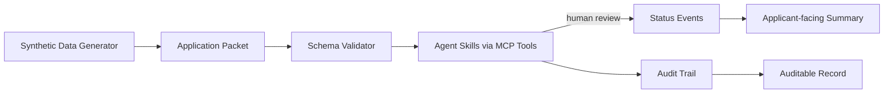
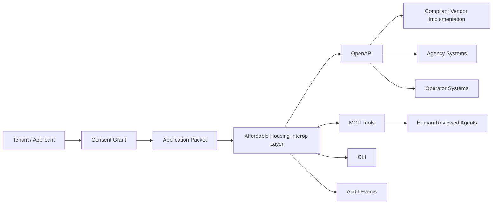
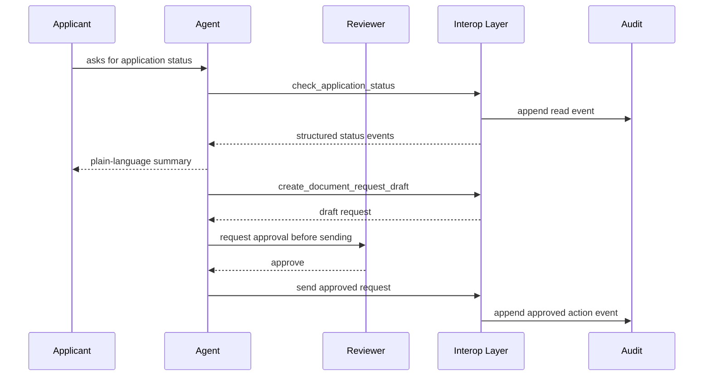

# Diagrams

## Architecture



## Civic Interop Layer



## Human-In-The-Loop Agent Flow



## Reference Layer vs Implementation Layer

```text
Reference layer
  - schemas
  - synthetic examples
  - reference API
  - MCP tool definitions
  - CLI workflow
  - principles

Implementation layer
  - live integrations
  - operator workflows
  - compliance automation configuration
  - product UX
  - deployment playbooks
  - production data handling
```
